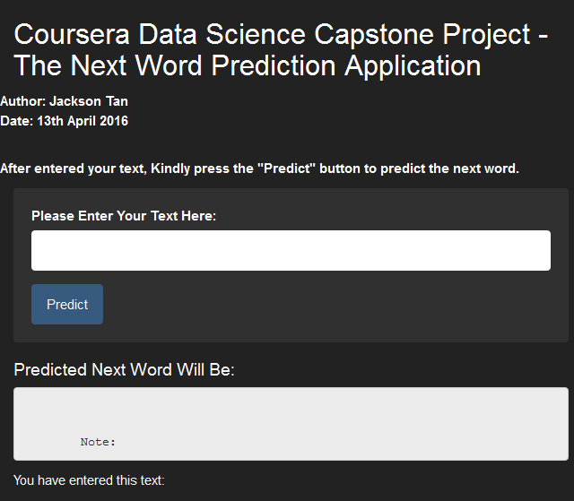

The Next Word Prediction Capstone Project (coursera.org)
========================================================
author: Jackson Tan 
date: 13th April 2016
autosize: auto

Introduction 
========================================================
This presentation is to describe the language modelling Capstone Project of Coursera Data Science Specialization.

**The Next Word Prediction** application is use to predict the next text word. There are three tyes of data (twitter, news, blog) use for train the model. The author has did the data cleaning and sub-setting technique to finalize the train data. Besides, he has did the combination (N-gram) to generated the clean data set and applied the Katz Back-off algorithm to predict the next word. Lastly, he has created prediction application and publish in shiny website.

This prediction application is quite useful for the mobile devices user when typing the text, because it able to:

* Reduce the typing speed.
* increase integrity of the spelling.

Shiny Application URL: https://jacksontan.shinyapps.io/CapstoneProject/

My Github URL        : www

Data Cleaning
====================================================

**The Author has grab sources from Coursera.org, and downloaded the three files (twitter, news and blogs), then do the cleaning steps**

- Firstly, randomly select the subset dataset from the three files and merge into 1.
- Before proceed to cleaning, the resources has extracted in various small chunk to avoid heavy loading on the PC.
- After that proceed to cleaning, the data will convert to lower case, removing punctuations, numbers, whitespace and non relevant characters.
- Generate the word combinations(N-gram) to 4-words, 3 words, 2 words, and 1-words.
- Then these 4 N-gram will be sorted after calculating the cumulative frequencies.
- Besides, filter the low frequecy n-gram to reduce the size for performance.
-Lastly, saved all the n-gram as R-Compressed files(.Rdata)

The word Predictive Model
=======================================
**The author has applied Katz Back-Off algorithm to generate the word prediction application. The process are...**

- First, load the data sets that sorted N-gram follow by frequencies.
- Do the filtering and cleaning to the training data sets.
- Identify the number of input word from the user.
- Then use a 4-gram to scan the last 3 word that entered by the user.
- The 4-gram will sort from highest to lowest frequency, the model will trying to predict the next word.
- If 4-gram not found, it will then back-off to 3-gram which is scan last 2 words of the word.
- If 3-gram not found, then back-off to 2-gram to match the last text.
- Lastly, if not found any matched in 2-gram, it will use the most comman word from the 1-gram to predict the next word.

The Prediction Application Interface
=======================================
**The Features of the Prediction Application**

- The application having a textbox for the user to enter the words.
- All the user entered word will show in the Application.
- The user should click "Predict" button predict the next words.
- Predicted word will dispay in the application.
- If the application not found the predictive word, it will request user to try another word.

       

Thank you !
